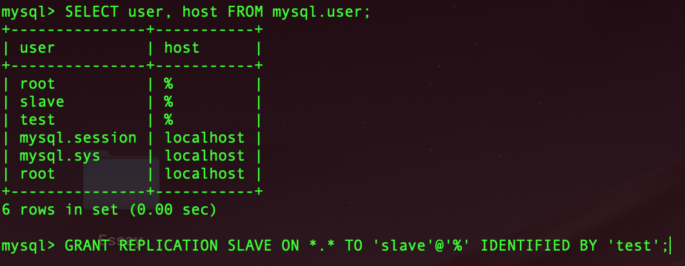
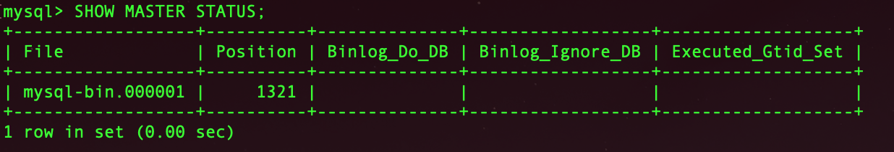
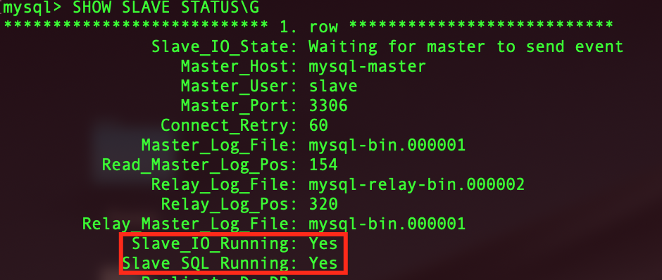
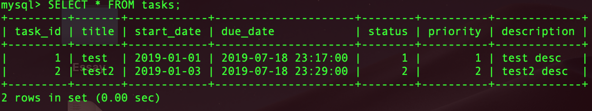
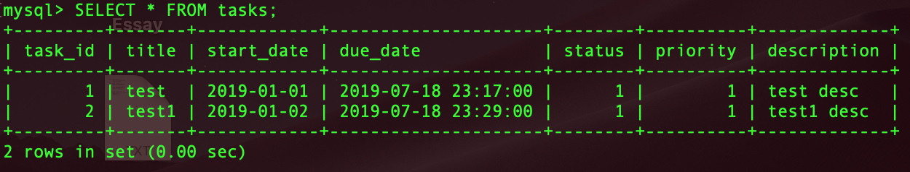

# MySQL Replication Test

To start you have to up docker containers:
> docker-compose up -d

### mysql-master container

1. > docker exec -it mysql-master bash

2. > mysql -uroot -ptest test

3. > GRANT REPLICATION SLAVE ON *.* TO 'slave'@'%' IDENTIFIED BY 'test';

4. > SHOW MASTER STATUS;

### mysql-slave1, mysql-slave2 containers

1. > docker exec -it mysql-slave1 bash

2. > mysql -uroot -ptest test

3. > CHANGE MASTER TO MASTER_HOST='mysql-master', MASTER_USER='slave', MASTER_PASSWORD='test',
     MASTER_LOG_FILE = 'mysql-bin.000001', MASTER_LOG_POS = 1321;

4. > START SLAVE;

5. > SHOW SLAVE STATUS\G

### Result

After creation table and some inserts I insert data to mysql-slave1 server and broke synchronization.

**mysql-master server**

**mysql-slave2 server**

*All required queries in **master.sql** and **slave.sql** files.*